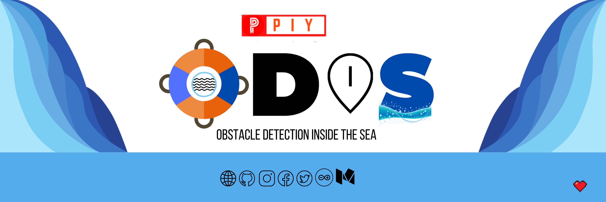

# ODIS
ODIS (Obstacle Detection Inside the Sea) 

## Abstract
- One of the problems facing by underwater vehicles and ships is in detecting any incoming obstacle to avoid collision which might lead to hazard. Thus, this project focused on the design an underwater obstacle detection system using sonar sensor. 
- This project uses sonar sensor as distance detection to determine the distance between sensor and obstacle and camera to predict the type of obstacle is it using Deep Learning.

## Introduction
  - Every day, many boats and ships run on the water and most of the ships have well defined navigating systems with radar technologies but most boats don’t have! Also the navigating systems are present for the upward detection not under water.

  - There are many cases we find most of the times where the boats or ships sink due to the underwater obstacles like huge ice blocks, rocks or any other underwater hindrances. But we found there were no certain devices or technologies which help in predicting underwater obstacles to detect the objects accurately and warn the pilot for the same. Also, if some devices are there, those are much expensive which are usually not affordable by the boatmen! Considering the said problem, we have come up with a unique and low cost solution.

  - Introducing, **ODIS** (Object Detection inside Sea); a smart device which will detect the underwater obstacles with the help of underwater radar and image processing. The device will detect the underwater obstacles with the help of radar technology and with the help of image processing we can get to know about what type of object is it and image processing with deep learning will increase the accuracy of the system. 

## Components
1.	Arduino Uno (for now later in actual model we can use Raspberry Pi for the whole system)
2.	Underwater radar senor/Ultrasonic Sensor
3.	Camera with thermal image processing
4.	Laptop/PC/Mac (a system where we can run the model for now).

## Methodology
Our system is based on two major factors for now:
1.	Radar Sensing
2.	Image Processing

### Radar Sensing
The radar sensing will be based on simple ultrasonic technology. The ultrasonic waves can travel inside the water. It works in the following principle:

Using the help of this technology, we can detect the underwater obstacles. The sensors will be fitted around the four corners of the ship/boat for better accuracy.

#### WorkFlow

### Image Processing
Image processing with Deep learning has great scope in detecting the objects accurately. It can also detect what type of object is it then it can respond accordingly. 

We’ll be using the Keras Model for the prediction and the images are trained using the Google’s Teachable Machine. It’ll basically detect the object under the water and give a result whether there are obstacles or not.

-----
### Contributors:
Saswat Samal | Sanket Sanjeeb Pattanaik
------------ | -------------
Software | Hardware
[ Saswat's Website](http://saswatsamal.me/) | [Sanket's Github](https://github.com/Sanket-Pattanaik)
